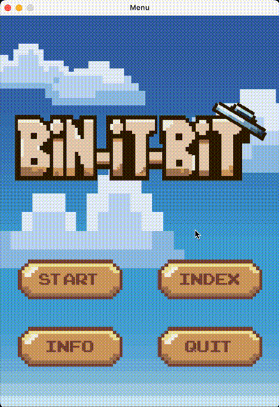

# 🗑️ Bin-It-Bit

#### **“Contamination is not great, but we have the best facilities in the U.S. that sort our material really well. I think the main problem is just getting more of the recycling into the recycling bin.”**
_Clare Miflin, director of the Center for Zero Waste Design._

## 🌆 **About**

> Bin-It-Bit is a 2D mini-game created in hopes of spreading environmental awareness and tackling one of the causes of climate change. We believe the first step to tackling climate change is changing the way we live our daily lives. It starts with YOU, and we are here to guide you to start a new habit: recycling.

> Users can learn what materials are recyclable in New York. Currently, New York's recycling system is underutilized and sometimes ignored. The game's goal is for users to be more conscious about the garbage they are throwing away and build sustainable recycling habits.

> This game is intended to appeal to younger audiences. 

## ❓ **How to Play**

- At game launch, there is a menu with the options to start game, see recyclable index, and an option to learn more information about recycling guidelines.

- Users play a mini game where they catch following obstacles (pieces of trash) using the appropriate bin for the given trash type
- ### Controls:
  - Use the **1, 2, 3,** and **4** keys to switch between bin types

  - Use the **arrow** (< >) keys to move the bin left and right
- Users gain points for collecting trash in the correct bins, and lose points if they fail to catch the falling trash or put it in the correct bin

- Users get a ending screen after gaining or losing points at a given threshold
---

## 💻 **How to Install**

1. pip install pygame
2. git clone git@github.com:dluzong/Bin-It-Bit.git
3. run main.py
---

## ✨ **What Inspired Us**

> With this being the team's first game created, we wanted to spread awareness on how the 'litter' things can bring irreversible consequences to our environment. We came up with a fun and exciting way to show how easy it is to contribute to saving the Earth's environment: by simply being mindful of where you toss your trash. Through our pixel art and fun story that many indie games use, we thought this would bring more attention about the consequences, especially to children who may not be aware of proper recycling habits. 

## 🎮 **Why a Game?**
We decided to create a game to encourage people to learn about recycling in a fun and engaging way! With its repetitive format and stunning visuals, users will be able to memorize the colors of the bins to the type of items they recycle and retain this information. These colors are also based on the standard recycle bin colors in New York City. 

## 🔨 **How we built it**

> #### Python, Pygame, Custom Made Assets, Paid License Assets/Music/SFX

---

## 💡 **Next Steps for Bin-It-Bit**

### Future goals include: 
- More examples of trash so the player can explore more types of trash and learn more facts about them.

- Difficulty levels to optimize player enjoyment

## License

    Copyright [2024]

    Licensed under the Apache License, Version 2.0 (the "License");
    you may not use this file except in compliance with the License.
    You may obtain a copy of the License at

        http://www.apache.org/licenses/LICENSE-2.0

    Unless required by applicable law or agreed to in writing, software
    distributed under the License is distributed on an "AS IS" BASIS,
    WITHOUT WARRANTIES OR CONDITIONS OF ANY KIND, either express or implied.
    See the License for the specific language governing permissions and
    limitations under the License.
